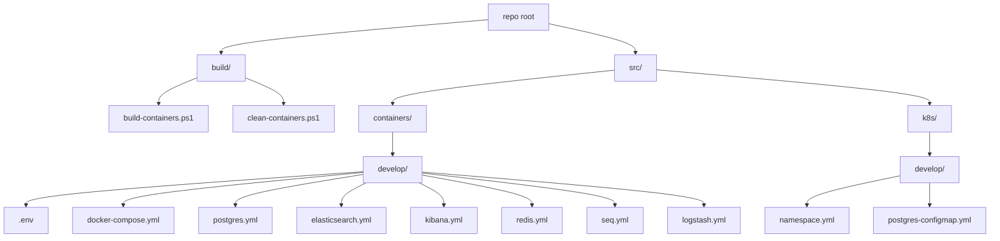
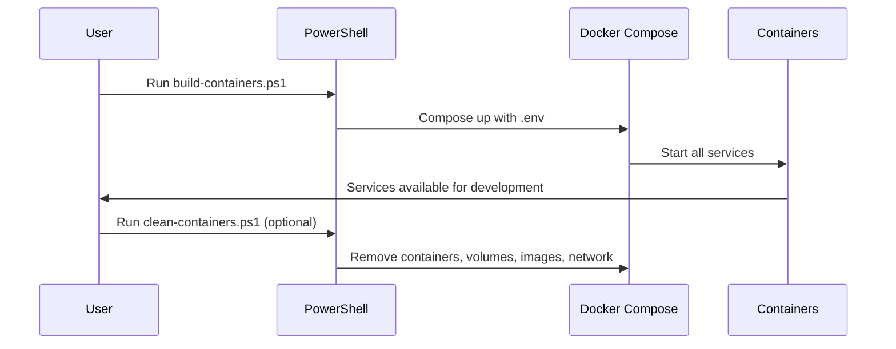
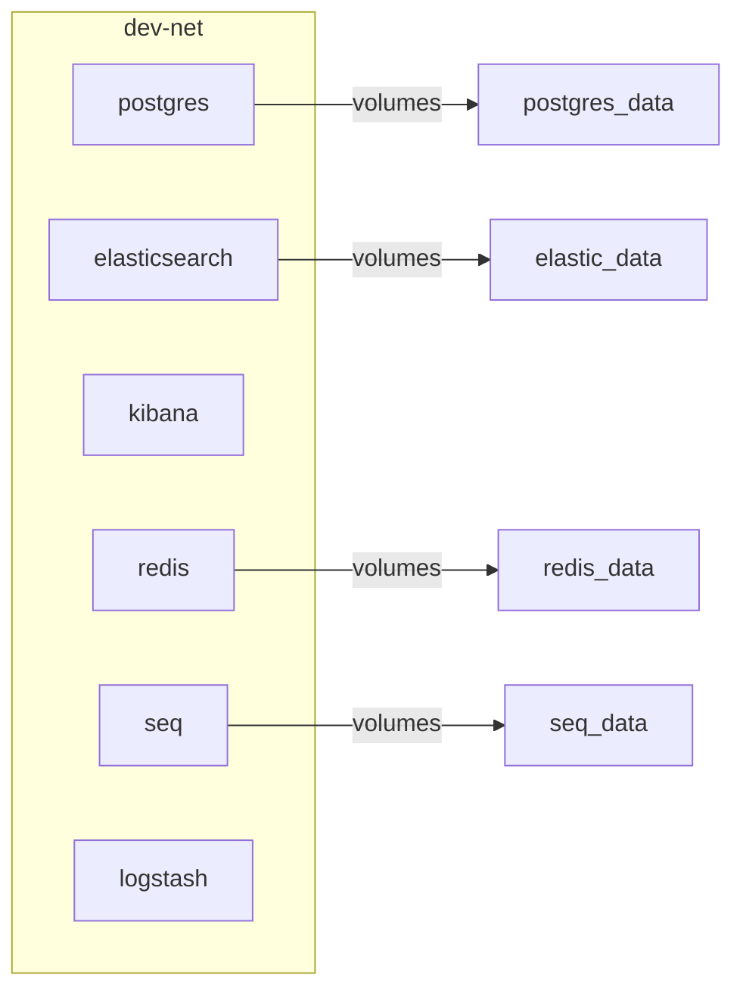

# Containers Infrastructure Repository

This repository provides a modular, orchestrated environment for local development and testing using Docker Compose and Kubernetes. It enables developers to quickly spin up essential infrastructure services—Postgres, Elasticsearch, Kibana, Redis, Seq, and Logstash—using containerization best practices.

---

## Scope

- **Local Infrastructure:** Provision databases, search engines, logging, and monitoring tools for development.
- **Orchestration:** Use Docker Compose for local environments and Kubernetes manifests for cloud-native deployments.
- **Modularity:** Each service is defined in its own YAML file for clarity and reusability.

---

## Folder Structure



- **build/**: Automation scripts for building and cleaning containers.
- **src/containers/develop/**: Docker Compose YAML files, one per service, plus `.env` for environment variables.
- **src/k8s/develop/**: Kubernetes manifests for namespace and configuration.

---

## Functionalities

- **Service Provisioning:** Instantiates Postgres, Elasticsearch, Kibana, Redis, Seq, and Logstash containers.
- **Environment Management:** Uses `.env` files for secrets/configuration.
- **Volume Management:** Persists data using Docker volumes.
- **Network Isolation:** All containers share a custom bridge network (`dev-net`).
- **Extensible YAML:** Each service is defined in its own YAML file and extended in `docker-compose.yml` for modularity.

---

## Execution Flow



1. **Build:**  
   Run `build/build-containers.ps1` to start all containers using Docker Compose and the `.env` file.
2. **Service Startup:**  
   Each service is started in its own container, connected to the shared network.
3. **Clean:**  
   Run `build/clean-containers.ps1` to stop and remove containers, volumes, and images.

---

## YAML Extension Pattern

- Each container has its own YAML file (e.g., `postgres.yml`, `elasticsearch.yml`).
- The main `docker-compose.yml` uses the `extends` keyword to include each service definition.
- This pattern:
  - **Improves maintainability:** Changes to a service only require edits to its YAML file.
  - **Promotes reusability:** Service definitions can be reused in other Compose files or environments.

```yaml
services:
  postgres:
    extends:
      file: postgres.yml
      service: postgres
```

---

## Kubernetes Integration

- **Namespace:** Defined in `src/k8s/develop/namespace.yml`.
- **ConfigMap:** Secrets/configuration for Postgres in `src/k8s/develop/postgres-configmap.yml`.
- **Ready for Cloud:** Easily migrate local Compose setup to Kubernetes manifests.

---

## Pros of This Orchestration

- **Isolation:** Each service runs independently, reducing conflicts.
- **Scalability:** Easily add/remove services by editing YAML files.
- **Consistency:** Developers share the same environment, reducing "works on my machine" issues.
- **Extensibility:** Modular YAML files simplify adding new services.
- **Persistence:** Data volumes ensure data survives container restarts.
- **Network Security:** Custom bridge network isolates traffic.

---

## Getting Started

1. **Clone the repo**
2. **Configure `.env`** in `src/containers/develop/`
3. **Run build script:**  
   ```powershell
   ./build/build-containers.ps1
   ```
4. **Access services:**  
   - Postgres: `localhost:5432`
   - Elasticsearch: `localhost:9200`
   - Kibana: `localhost:5601`
   - Redis: `localhost:6379`
   - Seq: `localhost:5341`
   - Logstash: `localhost:5044`

---

## Visual Overview



---

## Summary

This repository provides a robust, modular, and extensible infrastructure for development, leveraging container orchestration best practices. New users can quickly provision all necessary services, understand the architecture, and extend it as needed.
